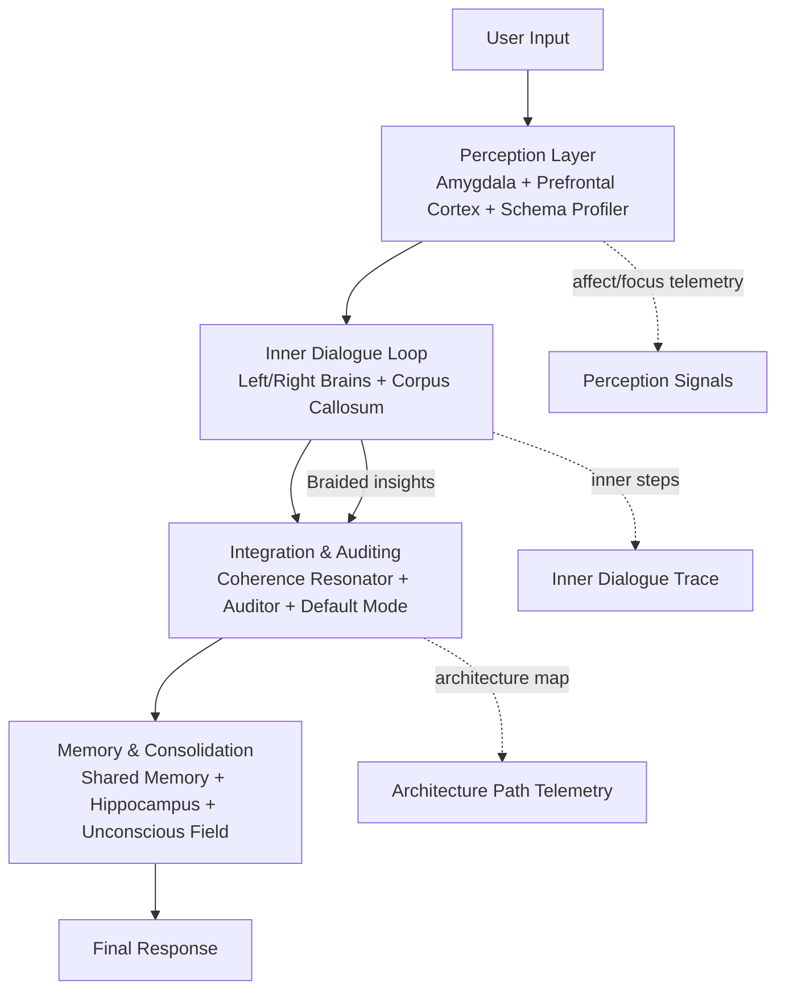

# SpiralReality Dual Brain LLM

The **Spiral Dual Brain LLM** experiment explores how a pair of cooperative language-model agents can solve complex tasks by emulating the interaction between the human left and right hemispheres. A lightweight orchestrator ("left brain") owns the primary conversation with a user, while a specialist agent ("right brain") can be summoned on demand through a configurable communication layer called the *corpus callosum*. Shared episodic memory keeps the context synchronized so both agents work from the same knowledge.

## Key Ideas
- **Dual-agent workflow** – the left brain triages requests and only escalates to the right brain when a domain-specific deep dive is warranted.
- **Adaptive co-leading policy** – the controller senses hemispheric bias, rotates leadership when balanced, and now braids right-brain preludes with left-brain drafts when signals are in equilibrium.
- **Collaboration resonance gauge** – a hemisphere signal + collaboration profile quantify left/right cue density, balance, and focus lift so braided replies and telemetry expose *why* the duet co-leads.
- **Neural impulse simulation** – biologically faithful action potential dynamics model neural activity during processing with realistic membrane potentials, refractory periods, synaptic transmission, and neurotransmitter modulation.
- **Pluggable corpus callosum** – switch between in-memory, Kafka, or MQTT transports without touching the business logic.
- **Trainable policy** – a simple PPO policy chooses when to invoke the right brain, enabling experimentation with reinforcement-learning driven cooperation.
- **Adaptive memory + telemetry** – enriched shared memory ranks past traces by similarity/tags, the hippocampus now archives hemispheric lead + collaboration strength, and the controller emits rollups for analytics.
- **Episodic collaboration atlas** – hippocampal traces log which hemisphere led, why it was chosen, and the average braid strength across recent episodes so downstream agents can tune retrieval bias.
- **Executive focus + unconscious cues** – a prefrontal-inspired module gates context while an unconscious field surfaces archetypal signals for tagging and auditing.
- **Emergent unconscious incubation** – unresolved material is cached in the unconscious, resurfacing as archetypal insight hints while stress from noisy inputs is discharged for the next reasoning loop.
- **Default mode reflections** – a resting-state network distils unconscious cache depth, stress release, and emergent archetypes into reflective prompts that enrich callosum payloads and final answers.
- **Basal ganglia gating** – action selection receives striatal-like go/inhibit signals tuned by novelty, affect, and focus feedback.
- **Psychoid attention bridging** – archetypal projections bend right-brain attention scores through a psychoid-aware adapter that exports QKV-friendly bias matrices and telemetry.
- **Coherence resonator + linguistic fabric** – balances hemispheric coverage/cohesion, stitches unconscious signifiers into the weave, and emits brainstem-style integration cues for the final answer.
- **Unconscious linguistic weaving** – archetypal traces, psychoid signifiers, and lexical texture are fused into a "[Unconscious Linguistic Fabric]" block so responses speak to language itself rather than semantics alone.
- **Motif cadence analysis** – captures alliteration, motif density, and rhythmic cadence across hemispheres so a "[Linguistic Motifs]" block can surface how language form evolves beyond semantics.
- **Architecture path narration** – final responses append an `[Architecture Path]` section summarising perception → dialogue → integration → memory stages for quick auditing.

## Architecture Overview (Braided Co-Lead Flow)


The controller now emits an explicit `architecture_path` telemetry event that summarises
how each perception, inner-dialogue, integration, and memory module participated in a
turn. Shared memory persists this architectural trace alongside inner-dialogue steps so
contributors can replay entire reasoning trajectories. The Mermaid source lives in
`docs/diagrams/dual_brain_architecture.mmd` for easy editing.

## Repository Layout
```
└── sr-dual-brain-llm/
    ├── core/
    │   ├── __init__.py
    │   ├── callosum.py             # Default asyncio in-memory transport
    │   ├── callosum_kafka.py       # Kafka-based transport skeleton
    │   ├── callosum_mqtt.py        # MQTT-based transport skeleton
    │   ├── orchestrator.py         # Left-brain coordinator
    │   ├── neural_impulse.py       # Biological action potential dynamics
    │   ├── prefrontal_cortex.py    # Executive-focus heuristics and gating
    │   ├── basal_ganglia.py        # Striatal go/no-go heuristics for consult control
    │   ├── default_mode_network.py # Resting-state reflections from unconscious summaries
    │   ├── psychoid_attention.py   # Project archetypal signals into QKV attention biases
    │   ├── policy_ppo.py           # PPO policy over discrete actions
    │   ├── policy_selector.py      # Heuristics for choosing the leading hemisphere
    │   ├── shared_memory.py        # Persistent memory helpers
    │   └── unconscious_field.py    # Archetypal unconscious field integration
    ├── scripts/
    │   ├── right_worker_broker.py  # Broker worker that runs the right brain
    │   ├── run_server.py           # Entry point using the in-memory backend
    │   └── train_policy.py         # Minimal PPO training loop
    └── samples/
        └── prompts/                # Example questions and prompts
```

Supporting assets live at the repository root:
- `LICENSE_NOTICE.txt`
- `docker-compose.yml`
- `requirements.txt`

## Neural Impulse Mechanism

The system now includes biologically faithful neural impulse simulation that models actual brain activity during processing:

### Key Biological Features
- **Action Potentials**: All-or-nothing electrical signals (~100mV amplitude, ~1ms duration)
- **Membrane Dynamics**: Realistic resting potential (-70mV) and threshold (-55mV)
- **Refractory Periods**: Absolute (1ms) and relative (3ms) refractory periods prevent immediate re-firing
- **Temporal & Spatial Summation**: Multiple synaptic inputs integrate over time to influence firing
- **Synaptic Transmission**: Chemical neurotransmitter release with realistic delays (~0.5ms)
- **Neurotransmitter Types**:
  - **Glutamate** (excitatory) - main excitatory neurotransmitter
  - **GABA** (inhibitory) - main inhibitory neurotransmitter  
  - **Dopamine** (modulatory) - reward and motivation signaling
  - **Acetylcholine** (modulatory) - attention and learning
  - **Serotonin** (modulatory) - mood and arousal regulation
- **Hebbian Plasticity**: Synapses strengthen when neurons fire together

### Neural Network Architecture
The system creates a dual-hemisphere neural network:
- **Left Hemisphere Pathway**: Sequential processing neurons (analytical)
- **Right Hemisphere Pathway**: Parallel processing neurons (holistic)
- **Basal Ganglia Modulator**: Dopaminergic neuron for action selection
- **Amygdala Modulator**: GABAergic neuron for risk-based inhibition
- **Prefrontal Modulator**: Cholinergic neuron for attention gating

### Neural Activity in Processing
During each processing turn, the system:
1. Simulates neural activity in the active hemisphere
2. Modulates firing based on affective state, novelty, and focus
3. Tracks action potentials and neurotransmitter release
4. Reports network activity metrics (firing rates, membrane potentials)
5. Includes neural activity summary in final responses

The neural activity provides a biologically grounded substrate that mirrors how real brains process information through electrical and chemical signals.

## Design Playbooks
- [Dual-Brain LLM Design Playbook](docs/dual_brain_design.md) – bridges analytical psychology, CBT, and neuroscience with the existing modules and outlines implementation backlogs.

## Prerequisites
- Python 3.10+
- Optional: Docker (for Kafka/Mosquitto brokers)

## Installation
```bash
python -m venv .venv
source .venv/bin/activate
pip install -r requirements.txt
```

## Running the Orchestrator (In-memory Backend)
```bash
python sr-dual-brain-llm/scripts/run_server.py
```
This launches the left-brain orchestrator and an in-process right-brain specialist connected via the asyncio corpus callosum.

## Switching Communication Backends
Set the `CALLOSUM_BACKEND` environment variable before starting any script. Supported values are:
- `memory` *(default)* – single-process asyncio messaging.
- `kafka` – publishes messages via Kafka topics.
- `mqtt` – routes requests with an MQTT broker (e.g., Mosquitto).

### Kafka Quick Start
```bash
docker-compose up -d            # starts Kafka and Mosquitto services
CALLOSUM_BACKEND=kafka python sr-dual-brain-llm/scripts/run_server.py
# In another terminal
CALLOSUM_BACKEND=kafka python sr-dual-brain-llm/scripts/right_worker_broker.py
```

### MQTT Quick Start
```bash
docker-compose up -d
CALLOSUM_BACKEND=mqtt python sr-dual-brain-llm/scripts/run_server.py
CALLOSUM_BACKEND=mqtt python sr-dual-brain-llm/scripts/right_worker_broker.py
```

## Training the PPO Policy
The bundled script demonstrates how to train the policy that decides when to escalate to the right brain.
```bash
python sr-dual-brain-llm/scripts/train_policy.py --algo ppo --epochs 200
```

## Example Interaction
```
User> Provide a detailed statistical analysis of this dataset.
Left Brain> Drafting an overview and consulting the right brain for deeper insights...
Right Brain> Returning detailed regression diagnostics and visual summaries.
Left Brain> Combined response with right-brain references.
```

## Contributing
1. Fork and clone the repository.
2. Create a new branch for your change.
3. Run `ruff` or your preferred linter before submitting a pull request.
4. Describe the backend configuration you tested in the PR body.

## License
See `LICENSE_NOTICE.txt` for third-party notices and licensing information.
